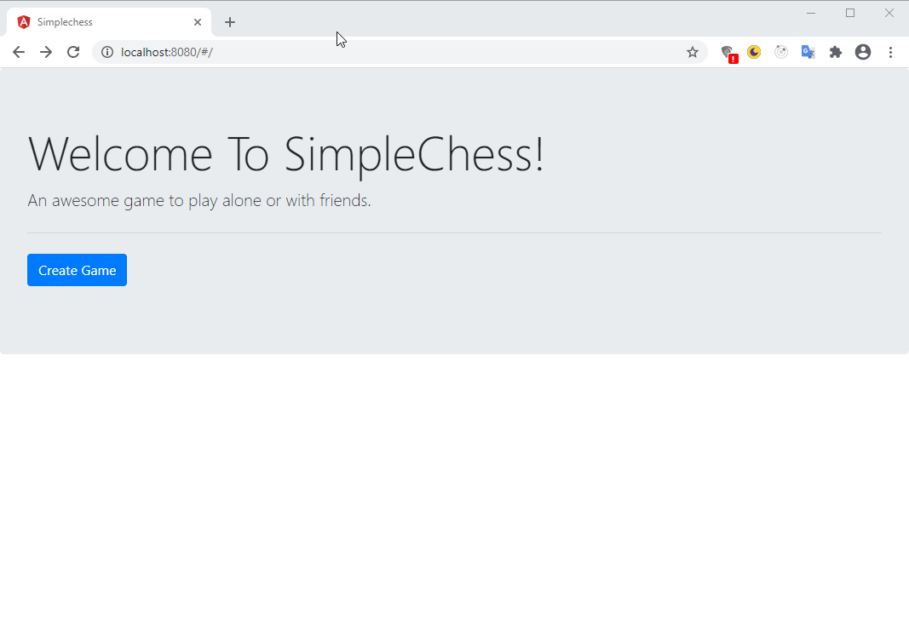

# SimpleChess Server

Simple game server implemented using Spring Boot and Angular. 

## Build

Run `./mvnw clean install` to build the project and its submodules.

## Run

To run the Spring Boot App call `java -jar backend/target/simplechess-backend-0.0.1-SNAPSHOT.jar` or use the Maven plugin `./mvnw -f backend/pom.xml`

and browse to [http://localhost:8080](http://localhost:8080).

